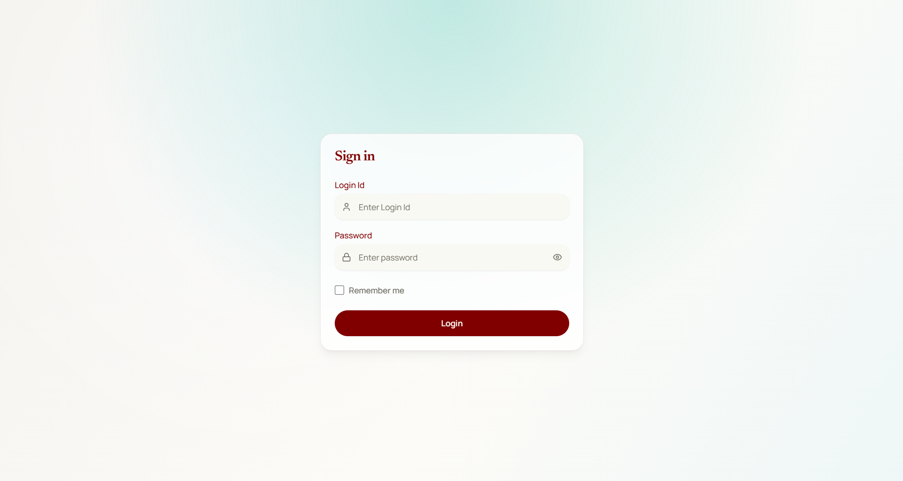

# EchoPress



EchoPress is a secure, role-based university magazine contribution platform built for `COMP1640 Enterprise Web Software Development`.

It turns the coursework brief into one clear workflow: students submit content, coordinators review it, managers prepare selected work for export, guests browse the approved archive, and administrators manage governance and monitoring.

## ✨ Why EchoPress

- 🔐 Role-based access keeps each user focused on the work they are responsible for.
- 🏫 Faculty-scoped visibility helps protect data and keeps workflows controlled.
- 📝 The contribution process supports deadlines, review, feedback, selection, and export in one place.
- 📊 Reporting and monitoring give both academic and operational visibility.
- 📱 The interface is responsive across desktop, tablet, and mobile.

## 👥 Core Roles

- 🎓 `Student` - create, save, and submit contributions with document and image upload.
- 🧭 `Coordinator` - review submissions, comment within the 14-day window, rate work, and select content.
- 📦 `Manager` - monitor selected contributions, view reports, and export publication-ready ZIP packages.
- 👀 `Guest` - browse selected contributions in a read-only archive experience.
- 🛠️ `Admin` - manage users, faculties, roles, contribution windows, and system monitoring.

## 🧰 Tech Stack

### Frontend

- React 19
- TypeScript
- Vite
- TanStack Router
- TanStack Query
- Tailwind CSS
- shadcn/ui and Radix UI
- Chart.js

### Backend

- ASP.NET Core Web API on `.NET 10`
- Layered backend structure: `CMS.Api`, `CMS.Application`, `CMS.Domain`, `CMS.Infrastructure`
- JWT authentication
- Argon2id password hashing
- Entity Framework Core

### Database

- PostgreSQL

## 🏗️ Architecture Overview

EchoPress uses a straightforward full-stack architecture:

`React frontend` -> `ASP.NET Core Web API` -> `PostgreSQL database`

The frontend handles the user experience for each role, the API enforces business rules and access control, and the database stores operational and reporting data.

## 📁 Repository Structure

```text
Backend/    ASP.NET Core API, application logic, domain, infrastructure
Frontend/   React frontend and role-based user interface
Database/   database-related files and setup notes
Documents/  coursework reports, demo scripts, and supporting materials
```

## 🚀 Getting Started

For setup and environment details, use the module-specific guides:

- [Frontend README](Frontend/README.md)
- [Backend README](Backend/README.md)
- [Database README](Database/README.md)

## 🎯 Project Focus

EchoPress was designed to be more than a set of pages. The goal was to deliver one coherent product with:

- secure access control
- clear role separation
- traceable contribution workflow
- practical reporting
- professional presentation quality
